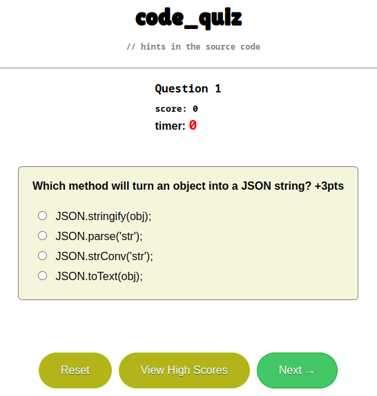

# module4_code_quiz
## Description
Available [here](https://johntg96.github.io/module4_code_quiz/)

10 questions to answer under 120 seconds about Web Development (primarily JavaScript).
Getting a question wrong results in a 20 second time deduction.
Your top 3 scores saved in your browser's local storage.

